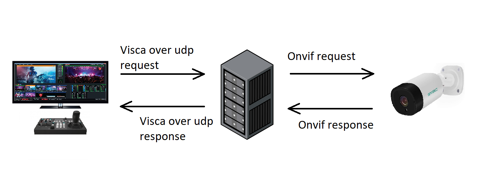
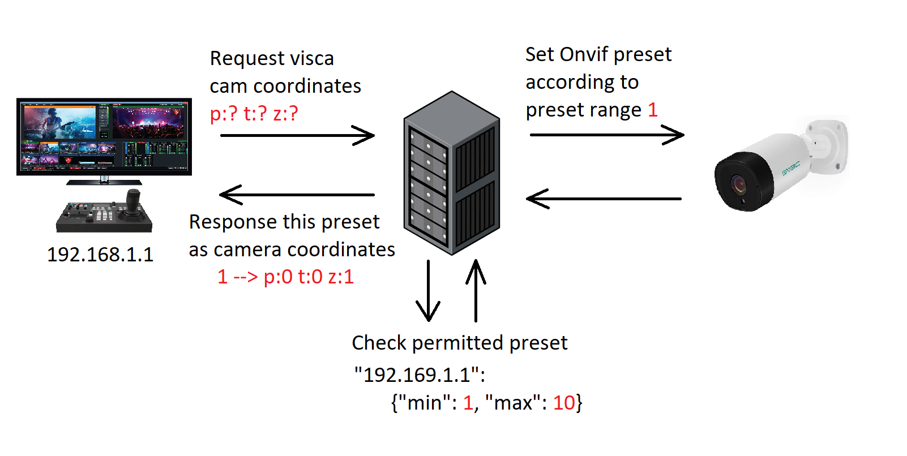
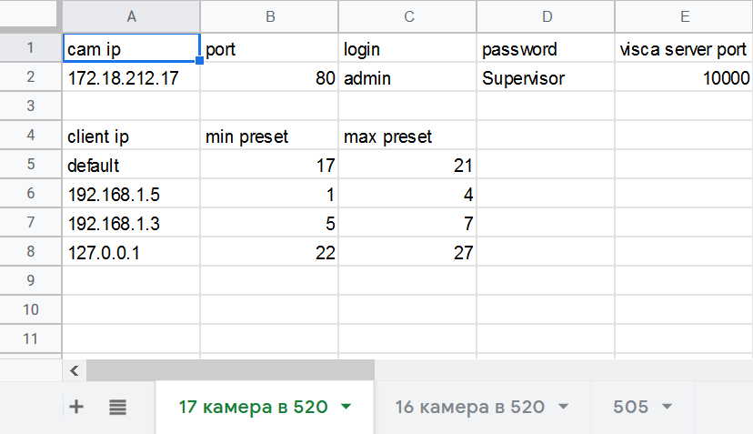
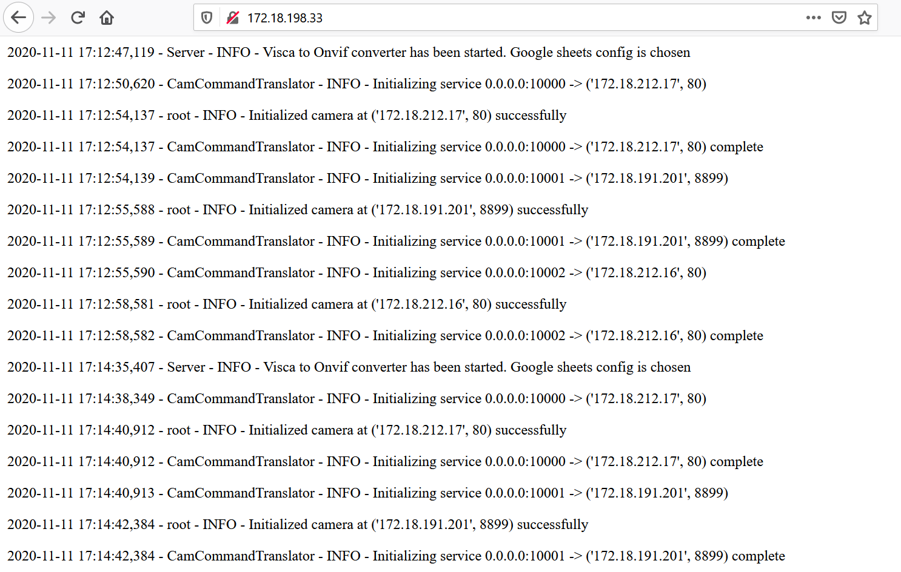
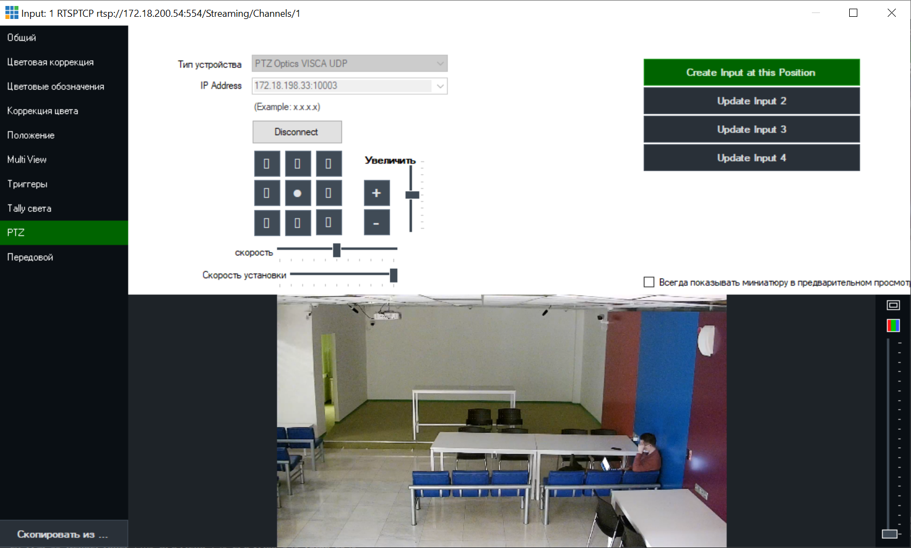
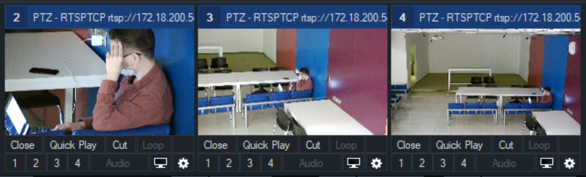

# Table of content
* [Visca to Onvif converter server](#visca-to-onvif-converter-server)
    * [Converter specifics](#converter-specifics)
* [Usage](#usage)
    * [File config](#file-config)
        * [Setup](#setup)
        * [Launch](#launch)
    * [Google sheets config](#google-sheets-config)
        * [Setup](#setup-1)
        * [Launch](#launch-1)
    * [Parameters](#parameters)
    * [Vmix use](#vmix-use)

# Visca to Onvif converter server
This is a **Visca over udp** to **Onvif** command converter which is implemented as server

## Converter specifics
Converter developed to use **Vmix** video production software functionality with *Onvif* cameras. In fact,
*Vmix* do not allows to handle *Onvif* protocol but works perfectly with lots of other control protocols such as 
*Visca over udp*. So the main idea behind this server is to connect *Vmix* software and 
*Onvif* cameras through server-mediator.

In practice, converter is a udp socket server 
which emulates *Visca over udp* camera and translate received
commands into *Onvif* protocol commands.



Now available pan, tilt and zoom movements and go to home position. Additionally, *Vmix* allows make camera *input* - 
remember camera position as *Visca* camera coordinates and than go to it if needed.
Usually, cheap *Onvif* cameras deviate from protocol standard and can not response it's coordinates, so this feature 
is implemented through *Onvif* preset setting logic.

In the case of *visca Vmix* client wants to create camera *input* in the particular position, it sends command to 
request *visca* camera positon. Converter receive this command
and create *Onvif* preset in the permitted in config preset range (see [usage](#usage)) for this *Vmix visca* client.
Than converter sends back to *Vmix visca* client this preset number instead of real coordinates.

If *Vmix* sends command to go to particular position, converter extract preset number out of go to coordinates
request and sets *Onvif* camera in this position.



# Usage
To experience full benefit from this converter recommended to use it paired with **Vmix**

Converter can be configured by either *file config* or *google sheets* document. By default *file config* is used.

## File config

### Setup

Config file path specified through `--conf` argument and should follow the next json structure:

```json
{
    "cams": [
        {
            "cam_ip": "192.168.0.1",
            "cam_port": 80,
            "cam_login": "admin",
            "cam_password": "password",
            "visca_server_port": 10000,
            "preset_client_range": {
                "192.168.1.1": {
                    "min": 21,
                    "max": 30
                },
                "192.168.1.2": {
                    "min": 11,
                    "max": 20
                },
                "default": {
                    "min": 21,
                    "max": 30
                }
            }
        },
        {
            "cam_ip": "192.168.0.2",
            "cam_port": 80,
            "cam_login": "admin",
            "cam_password": "password",
            "visca_server_port": 10001,
            "preset_client_range": {
                "192.168.1.1": {
                    "min": 21,
                    "max": 30
                },
                "192.168.1.2": {
                    "min": 11,
                    "max": 20
                },
                "default": {
                    "min": 21,
                    "max": 30
                }
            }
        }
    ]
}
```

As can be seen, `cam_ip`, `cam_port`, `cam_login` and `cam_password` fields describe *Onvif* camera that should be controlled

`visca_server_port` is a udp port converter reads *visca* commands from and translate it to the *Onvif* camera

`preset_client_range` contains clients addresses and related *Onvif* preset range. Once server receive *visca* coordinates
fetching request from specified in config *Vmix* client, it creates preset in the *Onvif* camera with `min` field value.
During the next fetching coordinates request from the same client
next in a row value will be used as a preset number and so on until `max` value is reached. Then preset appointment 
starts over from `min` value; `default` client address specified preset range for all unrecognised clients

Also server reads file config every 35 seconds so no needed to restart server to refresh cameras data, 
just putting it in the file and save will be enough

### Launch

Clone git repository
```shell script
git clone https://github.com/MikhaelMIEM/Visca-Onvif-converter-server.git
```
Run `main.py` script through `python3.8` with defining in `--conf` your json config file path
```shell script
cd ./Visca-Onvif-converter-server/converter
python3.8 main.py --conf ${YOUR_JSON_CONFIG_FILE_PATH}
```
Current logs in html format store in `index.html`  and available in the `./Visca-Onvif-converter-server/converter/logs` 
directory. Every day `index.html` is renamed with timestamp and logs store into new empty `index.html`
file.

Custom logs directory could be specified through `--logdir` flag

## Google sheets config
Another way to configure server is to use *Google sheets* table

### Setup
First, required to create *Google sheets* table and google service account with credentials in json format.
Then add this service account to the *Google sheets* table with *editor* access rights. All this steps described 
in [this video tutorial](https://www.youtube.com/watch?v=cnPlKLEGR7E&t=112s).

To enable *Google sheets* config use `--use-google` flag.
Define json google service account credentials path through `--json-keyfile` and spreadsheet name in `--spreadsheet`

Fill *Google table* as shown below



`cam ip`, `port`, `login` and `password` fields describe *Onvif* camera that should be controlled

`visca server port` is a udp port converter reads *visca* commands from and translate it to the *Onvif* camera

In the lower table section defines permitted preset ranges per user. `client ip`  contains clients addresses 
and related *Onvif* preset range. Once server receive *visca* coordinates
fetching request from specified in config *Vmix* client, it creates preset in the *Onvif* camera with `min` field value.
During the next fetching coordinates request from the same client
next in a row value will be used as a preset number and so on until `max` value is reached. Then preset appointment 
starts over from `min` value; `default` client address specified preset range for all unrecognised clients

New camera can be defined in the new worksheet list.

Server reads *Google sheets* config every 35 seconds. **It is not recommended to use more than 20 cameras** due to
google service account requests amount quota - 100 requests per 100 seconds; every worksheet requires unique request.
In the case of exceeding the quota or losing the Internet connection converter save previous working config settings.
**Max amount of cameras at a time - 50**

### Launch

Clone git repository
```shell script
git clone https://github.com/MikhaelMIEM/Visca-Onvif-converter-server.git
```
Edit `.env` file
```shell script
cd ./Visca-Onvif-converter-server/converter
vim .env
```
```shell script
JSON_KEYFILE=./visca-onvif-converter.json  # Google service account credentials json file
SPREADSHEET_NAME=visca_onvif_converter_config  # Name of config spreadsheet 
LOGDIR=./logs
```
Run docker-compose
```shell script
sudo docker-compose build
sudo docker-compose run -d
```
At docker-compose launch current logs are available in *hostname:80* and can seen through a browser




## Parameters

  `-h`, `--help`            show this help message and exit <br>
  `--use-google`         Enable google spreadsheet cams fetching <br>
  `--json-keyfile` `PATH`   Google api json creds <br>
  `--spreadsheet` `STRING_NAME` 
                        Google spreadsheet name <br>
  `--conf` `PATH`           Config file path <br>
  `--logdir` `DIRECTORY`    Directory to store log files <br>
  `--debug`, `-d`           Show console debug messages <br>
  
## Vmix use

After configuration and launching converter can be used by *Vmix*

In ptz settings choice `PTZ Optics VISCA UDP` command format and connect to *hostname:visca_port* specified in config.
All ptz movements provided by *Vmix* are translated to the *Onvif* cam.


By clicking on `Create Input at this Position`  *Vmix* creates presets at current position.

By clicking at a particular Input *Onvif* cam go to this position
