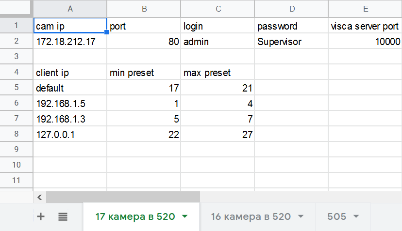
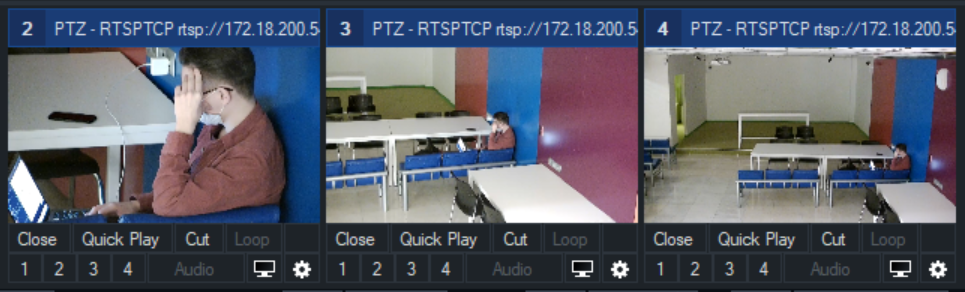
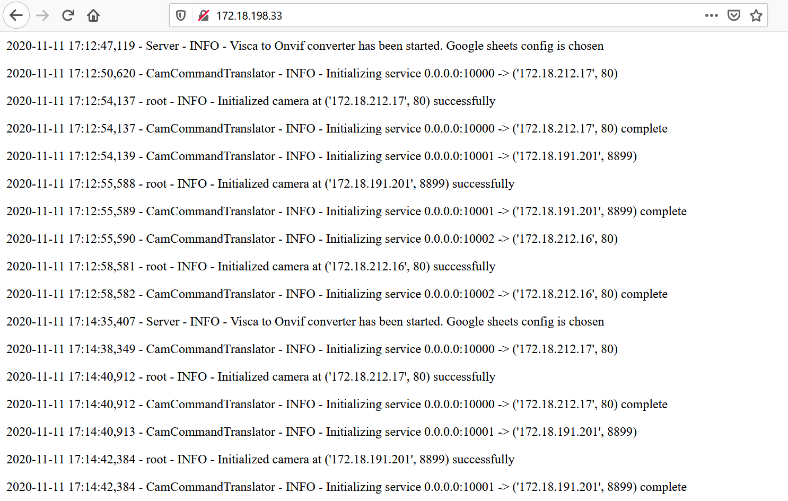

# Использование в медиацентре МИЭМ

**Visca Onvif конвертер** для *Vmix* доступен по адресу `172.18.198.33`. Этот адрес доступен только из сети вшэ. 

## Конфигурация

Конфигурируется инструмент через гугл таблицы. 

Сыллка на таблицу: https://docs.google.com/spreadsheets/d/18Ea-Gc4rWmG_WfEHAcUHoduTIUfzkeMEGRrxuKE_tbk/edit#gid=0 

Аккаунт для редактирования таблицы: `resources@miem.hse.ru`, пароль уточняйте в Медиацентре

Новая камера добавляется через новый лист снизу, при этом для каждой камеры должна сохраняться следующая структура:

Сверху таблицы задаются данные *Onvif* камеры, которой нужно управлять, в поле `visca server port` задается порт сервера, 
который принимает команды от *Vmix*. Таким образом, на картинке задано управление Onvif камерой `172.18.212.17`, *visca* 
команды для которой должны приходить на `172.18.198.33:10000`. 

В зоне таблицы с `client ip`, задается диапазон пресетов, которые использует конкретный пользователь.
 Пользователь определяется его ip адресом. Если пользователя идентифицировать не удалось, то он использует набор 
 пресетов, заданных через `default` пользователя. 

# Использование
 
После указания нужных камер в таблице, во *Vmix* подключаемся к серверу:

Клавиша `connect` присоединит *Vmix* к серверу и позволит управлять камерой, настроенной через конфиг в гугл-таблицах.

По нажатию на `Create Input at this position` создастся инпут из текущей позиции камеры:

Кликая на инпут, камера будет переходить в запомненное инпутом место.

Логи доступны по адресу `172.18.198.33` в браузере 

## Для разработчиков 

Исходный код и описание работы конвертера на английском языке доступны в 
https://github.com/MikhaelMIEM/Visca-Onvif-converter-server